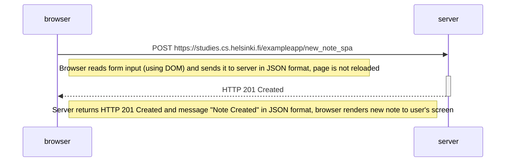

```mermaid
sequenceDiagram
    participant browser
    participant server

    browser->>server: POST https://studies.cs.helsinki.fi/exampleapp/new_note_spa

    Note right of browser: Browser reads form input (using DOM) and sends it to server in JSON format, page is not reloaded

    activate server
    server-->>browser: HTTP 201 Created
    deactivate server

    Note right of browser: Server returns HTTP 201 Created and message "Note Created" in JSON format, browser renders new note to user's screen
```
